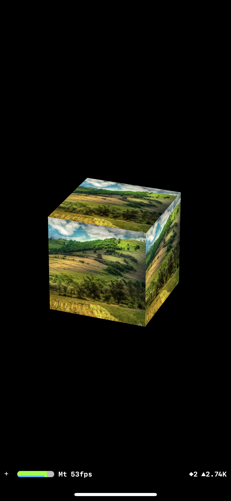

# SimpleShader
SimpleShader presents how to create a very simple Shader in Swift on iOS with Metal and SceneKit frameworks

You'll find my related article on Medium: https://medium.com/@MalikAlayli/metal-with-scenekit-create-your-first-shader-2c4e4e983300
  

